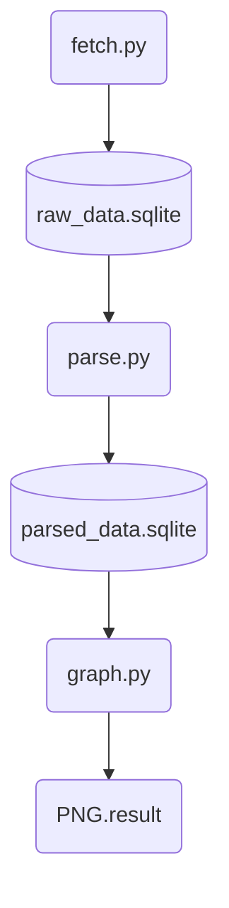

# NASA EONET Data Pipeline & Analytics

## Overview
A program to visualize natural events that occur around the world

## Features

- Handles user input, query parameters, database operations, and common runtime errors while maintaining high efficiency

- Warns users if they fetch fewer than 10,000 events for a year or fewer than 1000 events for a month, as the data might get truncated

- Uses spatial joins to process the dataset in batches before storing the parsed data in another database for maximum efficiencyy

- Converts the data into a bar charts (show total counts) and a line chart (show changes over time) 

- Bar charts are shown in both Linear scale (Actual data) and Log scale (Balanced data) to better handle heavily skewed data

## Project Workflow


## Technologies used

### Core & Database
- **Python 3.14.5** - Programming Language
- **SQLite 3.46.1** - Lightweight database for storing raw and processed data.
### Data Processing & Analytics
- **Pandas 3.0.3** - Tabular data manipulation and analysis
- **GeoPandas 1.1.3** - Geospatial data analysis (spatial joins)
- **ijson 3.5.0** - Iterative JSON parser for memory efficiency
- **Requests 2.34.2** - Sending HTTP requests to the NASA EONET API
### Data Visualization
- **Matplotlib 3.11.0** - Creating bars and lines graph visualizations

### GIS Assets
- **EEZ_land_union v4** - Land and sea boundary dataset for coordinate mapping (point-to-polygon)
### Python Built-in Libraries
- **json** - Parsing small-scale JSON data and converting Python objects into JSON string
- **time & datetime** - Managing request delays and time formats
- **traceback** - Error handling and system debugging

## Installation

### Prerequisites

Before running this project, install the following software:

- Python 3.11 or later
- Git (optional, for cloning the repository)
- DB Browser for SQLite (optional, for viewing the databases)

### Install Python Dependencies

```bash
pip install requests ijson geopandas pandas matplotlib
```

The EEZ Land Union dataset is already included in this repository and requires no additional installation.

## Usage
The project consist of three connected programs:

### fetch.py 
- Fetches natural event data from NASA EONET API and stores it in `raw_data.sqlite`

```bash
python3 fetch.py
```

### parse.py
- Processes and normalizes raw data, performs reverse geospatial mapping, and stores the results in `parsed_data.sqlite`

```bash
python3 parse.py
```

### graph.py
- Reads processed data from `parsed_data.sqlite` and generates the analyzed visualization in `result_graph` folder

```bash
python3 graph.py
```


## Results
 - **Country Ranking**
 >

 - **Category Ranking**
 >

 - **Event Over Time**

    > - **Trellis Graph**
    >>
    > - **Separate Line Graph**
    >>
    >>
    >>
    >>
    >>


## Current Limitation

- NASA EONET does not publish an official API rate limit. This project limits requests to 10,000 events per query to avoid straining the server

- Uses only the EEZ_land_union dataset, which is less accurate compared than geospatial API
- Spatial accuracy is limited to the point-to-polygon method, which only determines whether a coordinate belongs to a territory

- `parse.py` and `graph.py` do not support user-defined filter, making part of workflow hardcoded

- Results may be affected by data imbalance because NASA EONET provides coordinates based only on observation points

- Polygons centroids are manually calculated using the average of polygon points, making the implementation hardcoded 

- Does not include logging for easier debugging and and crash analysis
